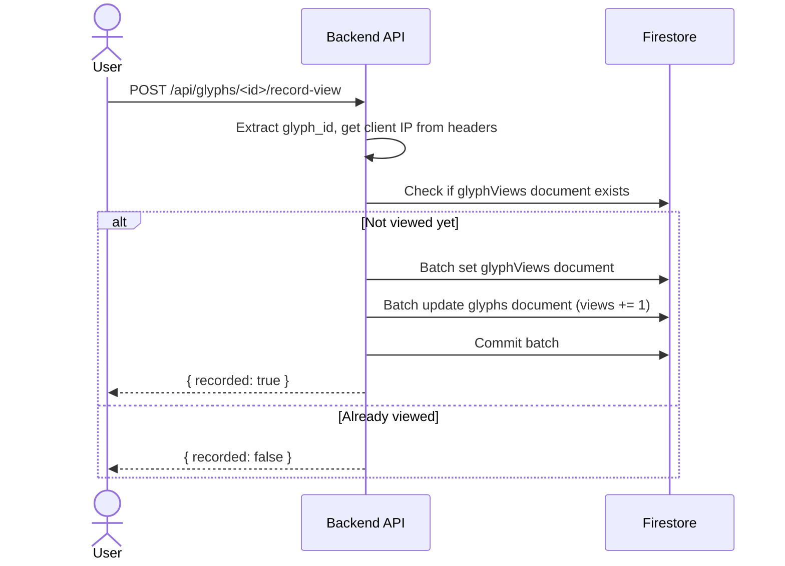
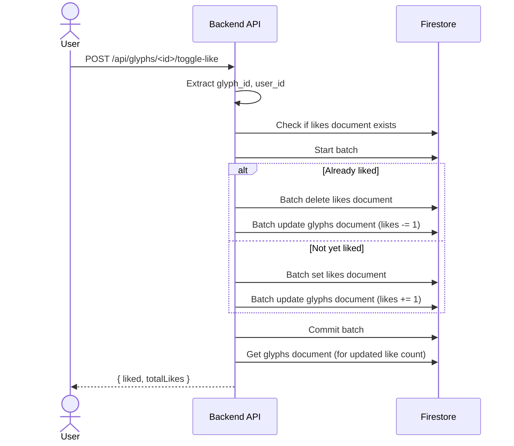
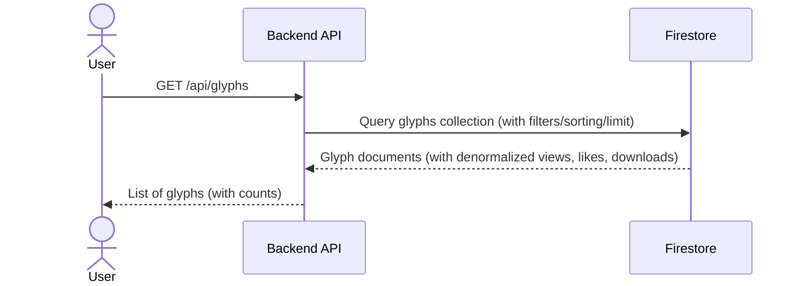
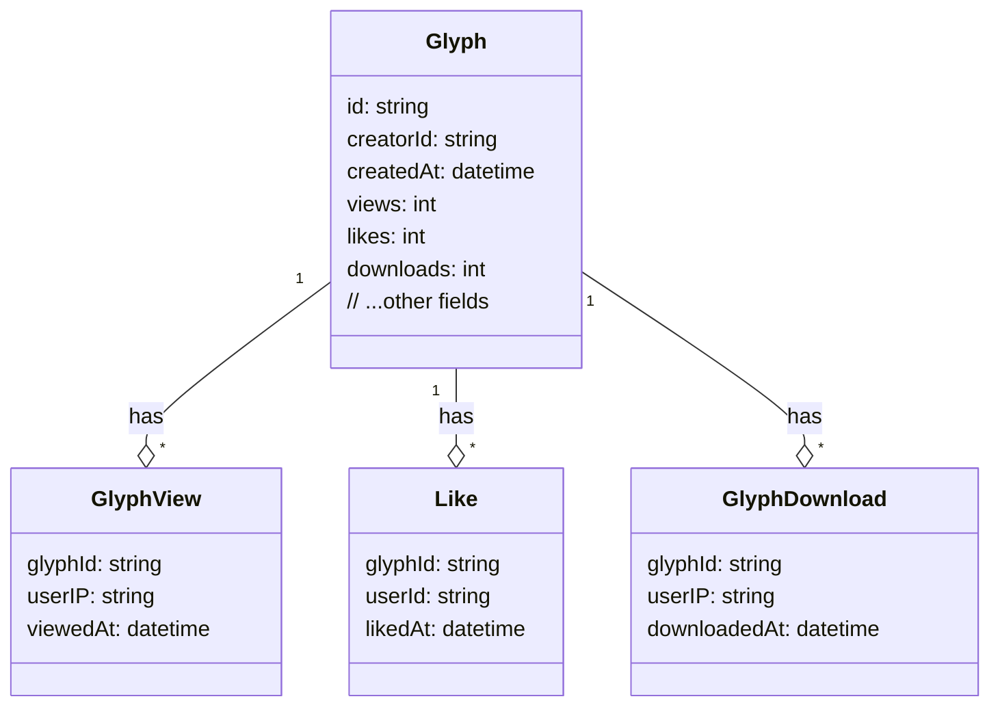

<!-- Generated by sourcery-ai[bot]: start review_guide -->

## Reviewer's Guide

Refactors Firestore queries for glyph retrieval to leverage composite indexes, denormalizes view/like/download counts, consolidates operations into batch writes, switches IP capture to request headers, and tightens authentication on glyph-request endpoints.

#### Sequence diagram for glyph view recording with batch write and denormalized count

#### Sequence diagram for toggling glyph like with batch write and denormalized count

#### Sequence diagram for glyph retrieval using denormalized counts and composite indexes

#### Class diagram for denormalized glyph data model

### File-Level Changes

| Change | Details | Files |
| ------ | ------- | ----- |
| Refactored glyph retrieval to use Firestore-side sorting and unified query execution | <ul><li>Replaced Python-side sorting for creator_id queries with Firestore order_by and composite indexes</li><li>Moved limit and stream execution outside conditional branches</li><li>Removed in-loop additional streams and sorting logic</li></ul> | `Backend/app.py` |
| Leveraged denormalized count fields instead of separate collection queries | <ul><li>Removed glyphViews, likes, downloads collection streams in get_glyphs and get_glyph</li><li>Populated views, likes, downloads directly from document fields with defaults</li></ul> | `Backend/app.py` |
| Consolidated record and update operations into batch writes for atomicity | <ul><li>Introduced db.batch() in record_view, record_download, toggle_like</li><li>Combined set/delete and Increment updates into single batch.commit()</li></ul> | `Backend/app.py` |
| Switched IP lookup to use request headers | <ul><li>Replaced get_external_ip() with request.environ HTTP_X_FORWARDED_FOR fallback_REMOTE_ADDR logic</li><li>Handled comma-separated forwarded IPs by selecting first address</li></ul> | `Backend/app.py` |
| Enforced stricter authentication on glyph-request routes | <ul><li>Replaced @require_auth with @require_auth_strict on all glyph-request endpoints</li></ul> | `Backend/app.py` |

---

Tips and commands

#### Interacting with Sourcery

- **Trigger a new review:** Comment `@sourcery-ai review` on the pull request.
- **Continue discussions:** Reply directly to Sourcery's review comments.
- **Generate a GitHub issue from a review comment:** Ask Sourcery to create an
  issue from a review comment by replying to it. You can also reply to a
  review comment with `@sourcery-ai issue` to create an issue from it.
- **Generate a pull request title:** Write `@sourcery-ai` anywhere in the pull
  request title to generate a title at any time. You can also comment
  `@sourcery-ai title` on the pull request to (re-)generate the title at any time.
- **Generate a pull request summary:** Write `@sourcery-ai summary` anywhere in
  the pull request body to generate a PR summary at any time exactly where you
  want it. You can also comment `@sourcery-ai summary` on the pull request to
  (re-)generate the summary at any time.
- **Generate reviewer's guide:** Comment `@sourcery-ai guide` on the pull
  request to (re-)generate the reviewer's guide at any time.
- **Resolve all Sourcery comments:** Comment `@sourcery-ai resolve` on the
  pull request to resolve all Sourcery comments. Useful if you've already
  addressed all the comments and don't want to see them anymore.
- **Dismiss all Sourcery reviews:** Comment `@sourcery-ai dismiss` on the pull
  request to dismiss all existing Sourcery reviews. Especially useful if you
  want to start fresh with a new review - don't forget to comment
  `@sourcery-ai review` to trigger a new review!

#### Customizing Your Experience

Access your [dashboard](https://app.sourcery.ai) to:
- Enable or disable review features such as the Sourcery-generated pull request
  summary, the reviewer's guide, and others.
- Change the review language.
- Add, remove or edit custom review instructions.
- Adjust other review settings.

#### Getting Help

- [Contact our support team](mailto:support@sourcery.ai) for questions or feedback.
- Visit our [documentation](https://docs.sourcery.ai) for detailed guides and information.
- Keep in touch with the Sourcery team by following us on [X/Twitter](https://x.com/SourceryAI), [LinkedIn](https://www.linkedin.com/company/sourcery-ai/) or [GitHub](https://github.com/sourcery-ai).

<!-- Generated by sourcery-ai[bot]: end review_guide -->